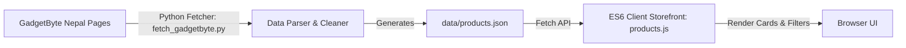
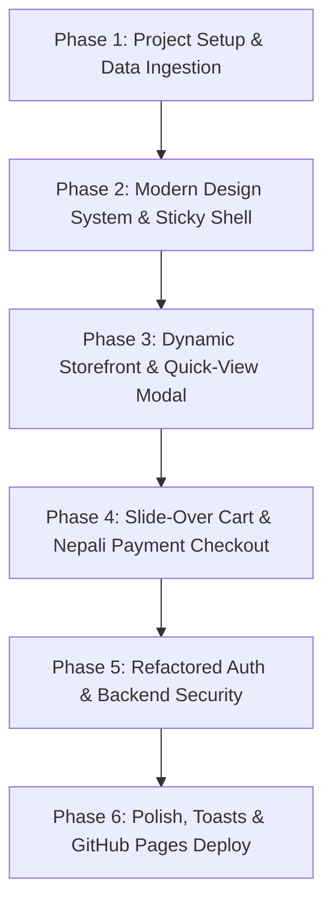

# 🚀 Modernization Roadmap & Architecture Plan (`Redesigned/Plan.md`)

> **Project**: Nepal Mobile Store — Next-Generation Modernization  
> **Repository**: [Jagdishsah/Redesigned_Nepal_Mobile_store](https://github.com/Jagdishsah/Redesigned_Nepal_Mobile_store)  
> **Lead Architect**: 💖 Your Zara 💖  
> **Date**: September 2026 / 2083 BS  

---

## 🎯 Project Vision

Transform the Grade 12 web project into a **state-of-the-art, high-performance, mobile-first e-commerce experience** tailored specifically for the mobile marketplace in Nepal.

The modernized store will combine modern UI aesthetics (glassmorphism header, smooth micro-interactions, responsive flex/grid layouts) with real-world e-commerce capabilities:
- **Live NPR Pricing**: Ingested directly from official Nepali tech portals like **GadgetByte Nepal**.
- **Interactive Storefront**: Live debounce search, brand filtering, sorting, price sliders, and quick-view modal.
- **Cart & Checkout Engine**: Slide-over cart drawer with live NPR calculations and local payment simulations (eSewa, Khalti, COD, Visa/Mastercard).

---

## 🏗️ Selected Architecture: Option 1 (Modern Pure Vanilla Web Stack)

Based on your selection, we are building with the **Modern Pure Vanilla Web Stack**:

- **Structure**: Semantic HTML5 with modern accessibility (`aria-*` tags).
- **Styling**: Modern CSS3 (CSS Custom Properties / Variables, Flexbox, Grid, Glassmorphism `backdrop-filter`).
- **Scripting**: Modular Vanilla ES6+ JavaScript (`app.js`, `cart.js`, `products.js`, `auth.js`) — zero heavy node_modules framework overhead.
- **Data Layer**: Live Nepali mobile prices ingested via Python into `data/products.json`.
- **Deployment**: 100% compatible with GitHub Pages with lightning-fast load times.

---

## 🔄 GadgetByte Nepal Data Ingestion Pipeline

To provide authentic, up-to-date pricing in Nepalese Rupees (NPR) and accurate specifications, we are building an automated ingestion pipeline:



### GadgetByte Sources
1. **Apple iPhones**: `https://www.gadgetbytenepal.com/apple-iphone-price-nepal/`
2. **Samsung Galaxy**: `https://www.gadgetbytenepal.com/samsung-mobiles-price-nepal/`
3. **Xiaomi / Redmi / POCO**: `https://www.gadgetbytenepal.com/xiaomi-mobiles-price-in-nepal/`
4. **OnePlus**: `https://www.gadgetbytenepal.com/oneplus-mobiles-price-nepal/`
5. **Nothing & CMF**: `https://www.gadgetbytenepal.com/nothing-phones-price-nepal/`
6. **Vivo / OPPO / Realme**: Brand pages on GadgetByte.

### Data Ingestion Script (`scripts/fetch_gadgetbyte.py`)
- Executes using `/home/jagdish/Desktop/py/.venv/bin/python`.
- Parses live mobile tables, extracts model names, variants (e.g., `12/256GB`), and price in NPR (e.g., `NPR 242,499`).
- Output format saved to `data/products.json`:

```json
[
  {
    "id": "iphone-17-pro-max-256",
    "brand": "Apple",
    "model": "iPhone 17 Pro Max",
    "variant": "256GB",
    "price_npr": 242499,
    "formatted_price": "NPR 242,499",
    "category": "Flagship",
    "image": "assets/images/iphone17promax.jpg",
    "specs": {
      "display": "6.9\" Super Retina XDR OLED 120Hz",
      "chipset": "Apple A19 Pro",
      "ram": "12GB",
      "storage": "256GB",
      "camera": "48MP Fusion Triple Camera",
      "battery": "4685 mAh"
    },
    "tag": "Best Seller",
    "in_stock": true
  }
]
```

---

## 📋 Step-by-Step Modernization Roadmap



### 📁 Phase 1: Directory Structure & Ingestion Tooling
- [ ] Establish folder tree (`css/`, `js/`, `data/`, `scripts/`, `assets/`).
- [ ] Create Python scraper `scripts/fetch_gadgetbyte.py` to populate `data/products.json`.
- [ ] Initialize `Work_Step.md` & `Files.md` in `Redesigned/`.

### 🎨 Phase 2: Modern Design System & Layout Shell
- [ ] Define CSS Custom Properties in `css/main.css` (Colors: Electric Blue `#0F62FE`, Dark Slate `#0F172A`, Nepalese Amber `#F59E0B`, Glassmorphism `#ffffff15`).
- [ ] Build glassmorphism sticky header with backdrop blur, brand logo, search trigger, cart badge, and animated mobile menu.
- [ ] Build dynamic Hero carousel featuring top flagship releases in Nepal.
- [ ] Build trust reassurance bar (Official Nepal Warranty, VAT Bill, Fast Delivery across Nepal).

### 📱 Phase 3: Dynamic Storefront, Filtering & Quick View
- [ ] Build `js/products.js` to render product grid from `data/products.json`.
- [ ] Implement live search with instant debounce matching model & brand.
- [ ] Implement brand filter pills (`All`, `Apple`, `Samsung`, `Xiaomi`, `OnePlus`, `Nothing`).
- [ ] Implement price range slider & sorting (Low to High, High to Low, Most Popular).
- [ ] Build Quick-View modal popup showing detailed specs without leaving the catalog.

### 🛒 Phase 4: Slide-Over Shopping Cart & Checkout Flow
- [ ] Build `js/cart.js` managing cart state, item quantities, and `localStorage` persistence.
- [ ] Build slide-over cart drawer with smooth transition and live NPR subtotal.
- [ ] Build Checkout Modal with Nepali address selector (Province, District, City) and payment methods:
  - Cash on Delivery (COD)
  - eSewa / Khalti simulation
  - Card (Visa / Mastercard)

### 🔐 Phase 5: Modernized Auth & Security
- [ ] Redesign [form.html](file:///home/jagdish/Desktop/Sandbox/Zara/Nepal/Redesigned/form.html) & [register.html](file:///home/jagdish/Desktop/Sandbox/Zara/Nepal/Redesigned/register.html) with floating labels and live password strength indicator.
- [ ] Replace native alerts with custom non-blocking Toast Notifications.
- [ ] Refactor [day.php](file:///home/jagdish/Desktop/Sandbox/Zara/Nepal/Redesigned/day.php) to use PDO prepared statements and `password_hash()`.

### ✨ Phase 6: Final Polish & Deployment
- [ ] Dark/Light mode theme switcher.
- [ ] OpenGraph SEO tags for social sharing.
- [ ] Push commit to `Jagdishsah/Redesigned_Nepal_Mobile_store` on GitHub.

---

## 📌 Target Directory Layout

```text
Redesigned/
├── 📄 index.html             # Revamped modern storefront
├── 📄 form.html              # Modernized authentication portal (Login)
├── 📄 register.html          # Modernized registration form
├── 📄 contact.html           # Enhanced contact, FAQ, and support hub
├── 📄 about.html             # Company profile and trust badges
├── 📋 Plan.md                # This modernization plan
├── 📋 Work_Step.md            # Task execution checklist
├── 🗺️ Files.md                # Codebase file map
├── 📁 css/
│   ├── main.css              # Design tokens, variables, base styling
│   ├── components.css        # Navbar, buttons, cards, modals, toast styles
│   └── responsive.css        # Breakpoint media queries
├── 📁 js/
│   ├── app.js                # Core app initialization & router
│   ├── cart.js               # Cart drawer state & localStorage
│   ├── products.js           # Dynamic product renderer, search & filters
│   └── auth.js               # Validation & toast feedback
├── 📁 data/
│   └── products.json         # Real NPR prices ingested from GadgetByte Nepal
├── 📁 scripts/
│   └── fetch_gadgetbyte.py   # Python scraper for live GadgetByte data
└── 📁 assets/                # WebP images & SVG badges
```
